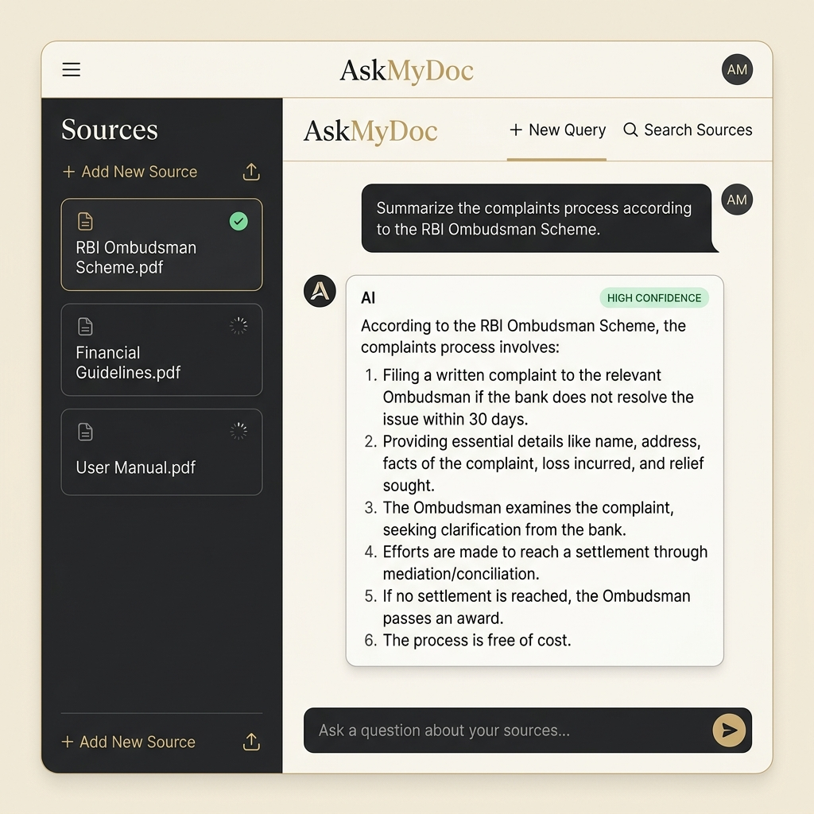

<div align="center">
  <h1 align="center">AskMyDoc: NotebookLM RAG</h1>
  <p align="center">
    <strong>A production-ready RAG application that lets you upload and chat with your documents.</strong>
  </p>
  
  <br />
  
  <a href="https://askmydoc-ljfv.onrender.com" target="_blank">
    
  </a>
  <p><em>Turn any static PDF into an intelligent conversation in seconds. No setup required.</em></p>

  <br />
  
</div>


---

## 🌟 Overview
**AskMyDoc** is an end-to-end Retrieval-Augmented Generation (RAG) web application inspired by Google NotebookLM. It allows users to upload PDF documents, parses and splits them into intelligent semantic chunks, and allows for natural language conversations grounded strictly in the document's content.

## ✨ Key Features
- 🚀 **Lightning Fast LLM**: Powered by **Groq** (`llama-3.1-8b-instant`) for instantaneous, deterministic, and grounded responses.
- 🧠 **Free Local Embeddings**: Utilizes **HuggingFace** (`Xenova/all-MiniLM-L6-v2`) to generate local embeddings at zero cost.
- 🗄️ **Advanced Vector Storage**: Integrates with **Pinecone** for high-performance semantic retrieval and namespace isolation.
- 🏗️ **Parent Document Retrieval**: Implements a dual-chunking strategy (3000-char parent context / 400-char child vectors) to maximize retrieval precision while preserving deep context for the LLM.
- 💬 **Conversational Memory**: Features active chat history routing. The AI intelligently reformulates follow-up questions into standalone queries before searching the vector database, allowing for natural, continuous conversations.
- 🎯 **Answer Confidence Scoring**: Calculates similarity scores from Pinecone and displays dynamic grounding confidence badges (**HIGH CONFIDENCE**, **LOW CONFIDENCE**, or **NOT FOUND IN DOCUMENT**) in the UI.
- 📁 **Preloaded Demo Mode**: Instantly load and test-query the preloaded "RBI Integrated Ombudsman Scheme 2021" policy document without uploading.
- 🛡️ **Safety Guardrails & Limits**: Enforces a strict 3-document upload limit to control resource consumption and namespace clutter.
- 🎨 **Premium User Interface**: Features a highly aesthetic, responsive, and minimalist frontend inspired perfectly by Google NotebookLM (built with pure HTML/CSS/VanillaJS).
- 🔐 **Strict Grounding**: System prompts explicitly force the AI to answer *only* from the provided context, eliminating hallucinations.

## 🛠️ Technology Stack
- **Backend:** Node.js, Express.js
- **Frontend:** Vanilla HTML, CSS (Tailwind), JavaScript
- **RAG Pipeline:** LangChain.js (`@langchain/community`, `@langchain/groq`, `@langchain/pinecone`)
- **Document Parsing:** `pdf-parse` & `pdfjs-dist` with OCR API fallback for scanned documents

## 🚀 Getting Started

### 1. Prerequisites
- Node.js (v18+)
- A Groq API Key (Free)
- A Pinecone API Key & Index Name (Free)

### 2. Installation
Clone the repository and install the dependencies (use `--legacy-peer-deps` due to LangChain peer requirements):
```bash
git clone https://github.com/swarnika-cmd/AskMyDoc.git
cd AskMyDoc
npm install --legacy-peer-deps
```

### 3. Environment Setup
Rename `.env.example` to `.env` and fill in your keys:
```env
GROQ_API_KEY=your_groq_api_key_here
PINECONE_API_KEY=your_pinecone_api_key_here
PINECONE_INDEX=askmydoc
PORT=3000
```

### 4. Running the App
Start the Express server:
```bash
node server.js
```
Navigate to `http://localhost:3000` in your browser. Upload one or multiple PDFs, wait for the ingestion process, and start asking questions! The AI will automatically search across **all** documents added to the sidebar.

## 📦 Deployment
This project is perfectly structured for immediate deployment on PaaS providers like **Render.com** or **Railway**. Simply connect the GitHub repository, set your Build Command to `npm install --legacy-peer-deps`, set your Start Command to `node server.js`, and add your `.env` variables in the dashboard!
